# Tutor-App-Android-Studio-Kotlin-
Mini Project (Associated with ADVANCED ANDROID APP DEVELOPMENT Subject [CSE227] at Lovely Professional University)

## Project Overview

This project aims to create a Tutor App using Android Studio and Kotlin. It includes the following features:

1. **Sign In:** Users can log in with their credentials. This feature ensures that only registered users can access the app's functionalities, maintaining security and privacy.

2. **Sign Up:** New users can create a new account. The signup process collects essential information from users to create their profiles and grant them access to the app.

3. **Tutor List:** Users can view all available tutors. This feature provides a comprehensive list of tutors, including their profiles, expertise, and availability.

4. **Tutor Profile:** Users can view tutor profiles and book slots for classes. This feature allows users to explore detailed information about tutors, such as their qualifications, experience, and ratings from other users. Users can also book slots for classes based on the tutor's availability.

5. **Nearby Tutors (MapView):** Utilizes OpenStreetMap to show nearby tutors in MapView. This feature uses geolocation to display tutors near the user's current location on a map, making it convenient for users to find local tutors.

6. **Profile Management:** Users can check and update their profiles. This feature enables users to edit their profile information, such as their name, contact details, and profile picture, ensuring that their information is up to date.

7. **Rating System:** Includes a rating bar for users to give feedback, with notifications for received ratings. This feature allows users to rate tutors based on their experience, providing valuable feedback to improve the quality of tutoring services. Users also receive notifications when they receive ratings from other users.

8. **Feedback Submission:** Users can submit feedback, stored in a real-time database. This feature allows users to share their feedback and suggestions about the app's functionality, user experience, and overall satisfaction, helping developers enhance the app based on user input.

9. **FAQ:** Users can access app details and necessary information. This feature provides a comprehensive FAQ section where users can find answers to common questions about the app's features, usage guidelines, troubleshooting tips, and contact information for support.

10. **Sharing:** Users can share the app with others on their phones. This feature allows users to easily share the app with friends, family, or colleagues via messaging apps, social media platforms, or email, expanding the app's user base and visibility.

11. **Logout:** Users can log out of the app. This feature allows users to securely log out of their accounts, ensuring that their session is terminated and their data remains private.

## Project Images

    
    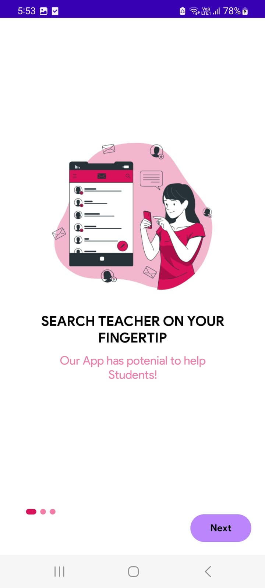
    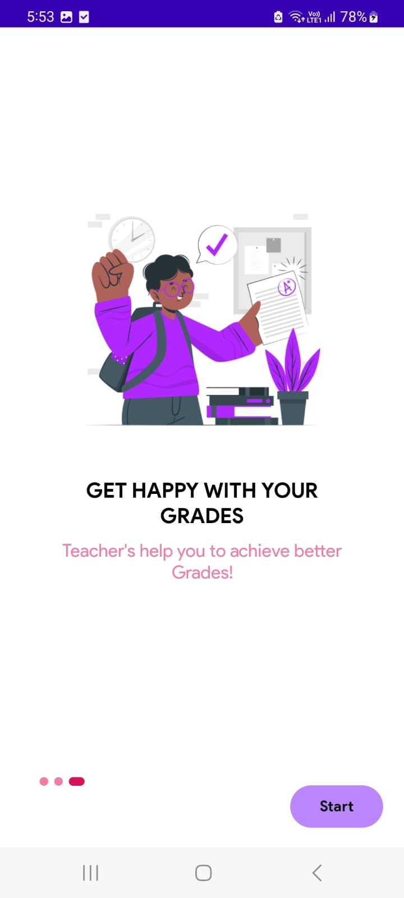
    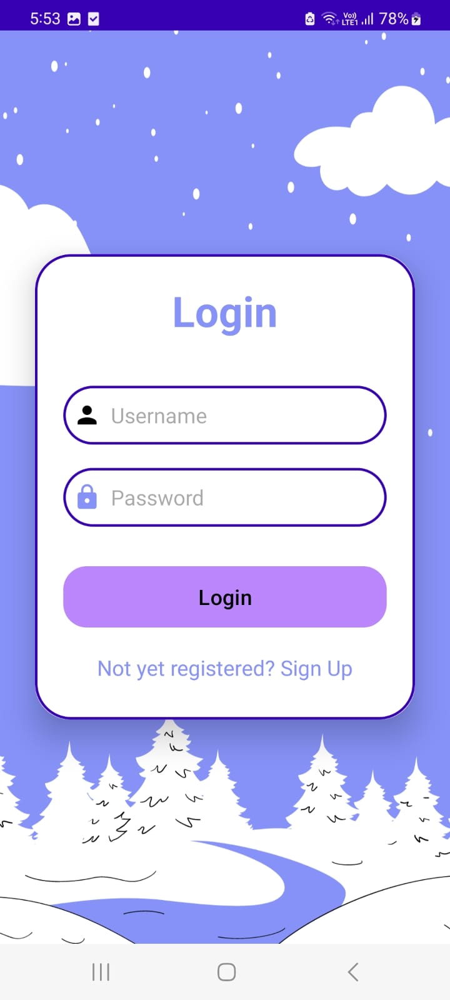
    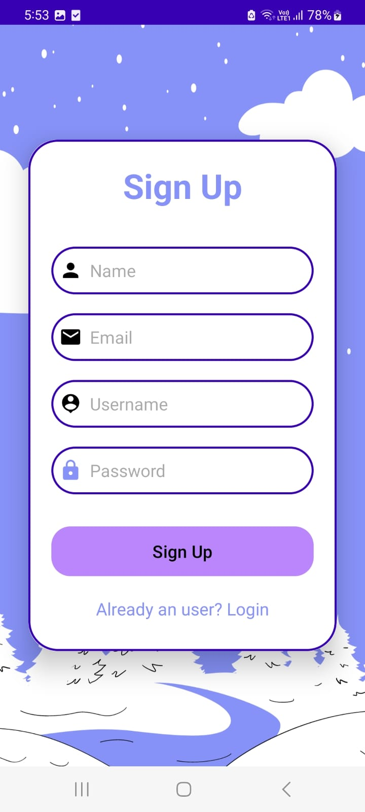

    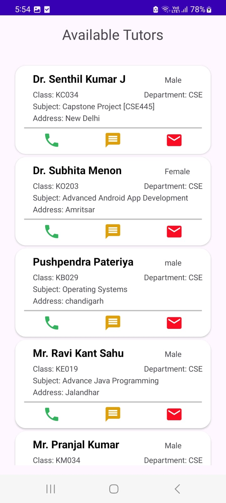
    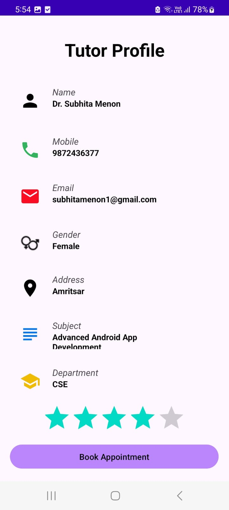
    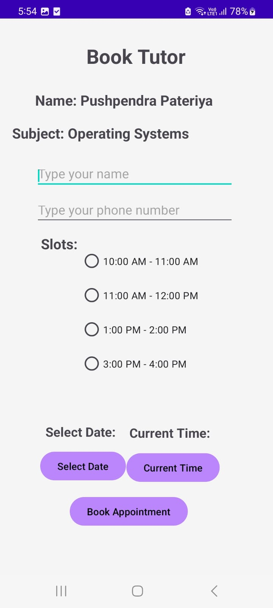
    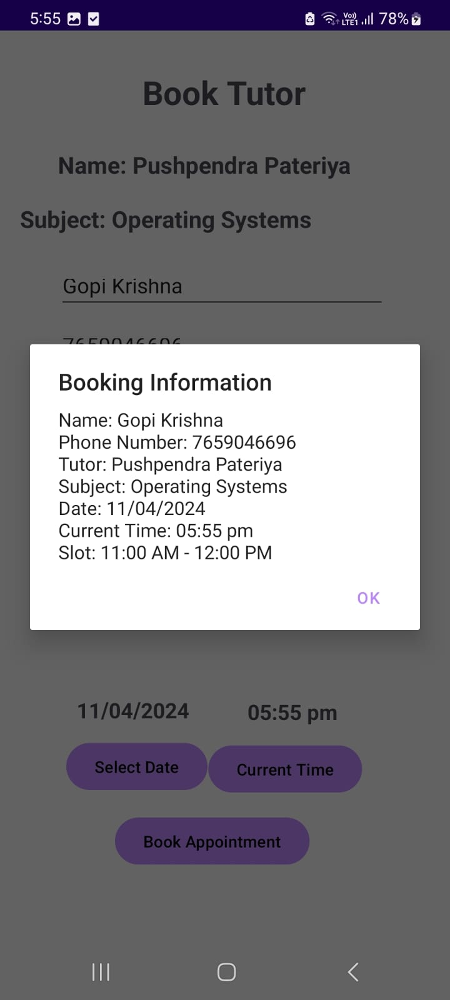
    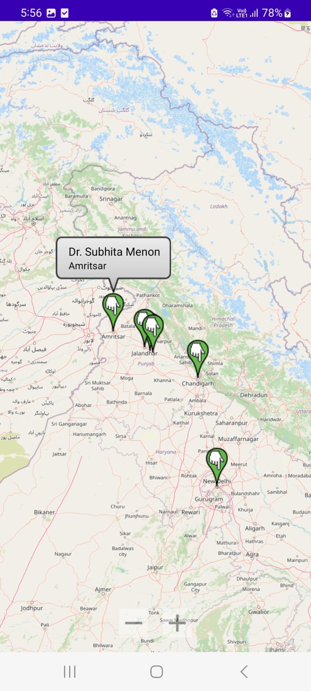

    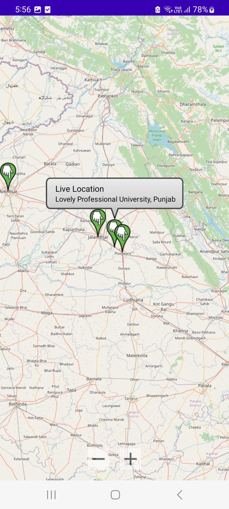
    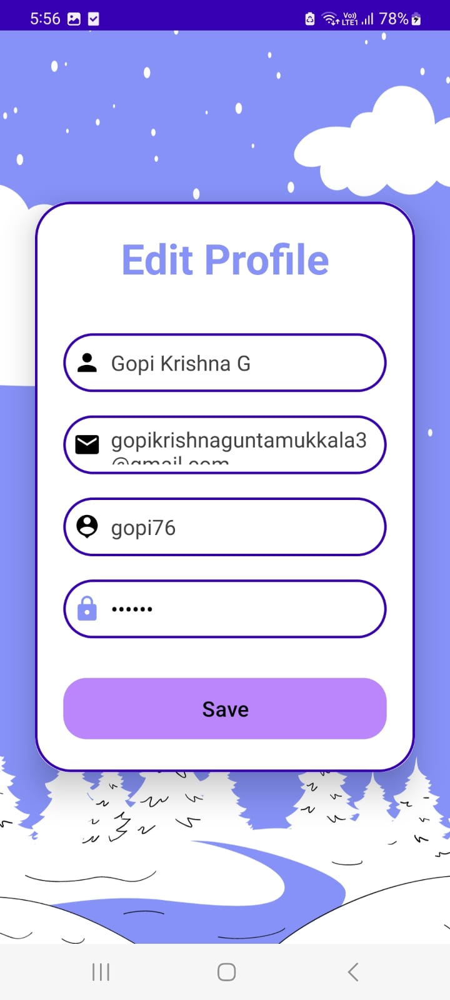
    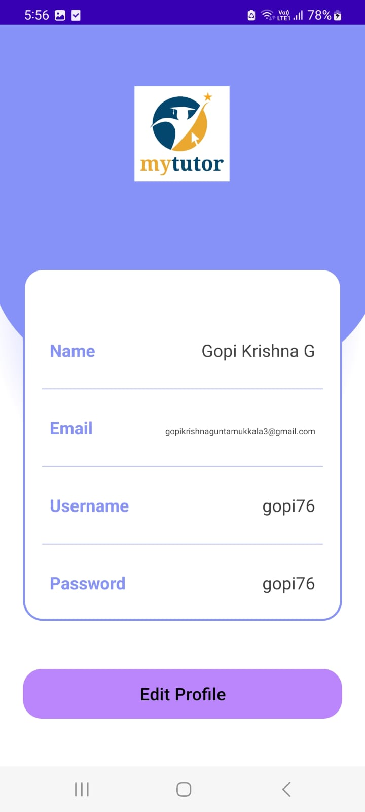
    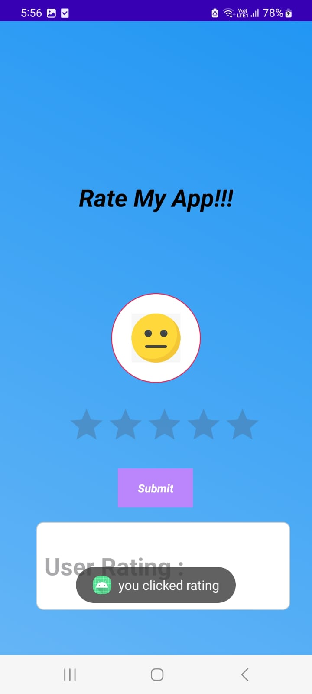
    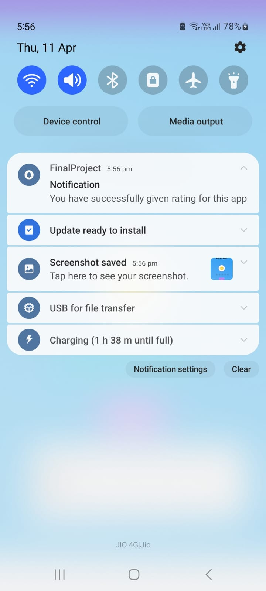

    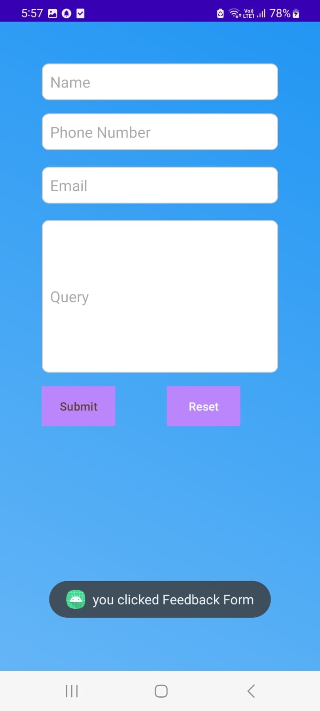
    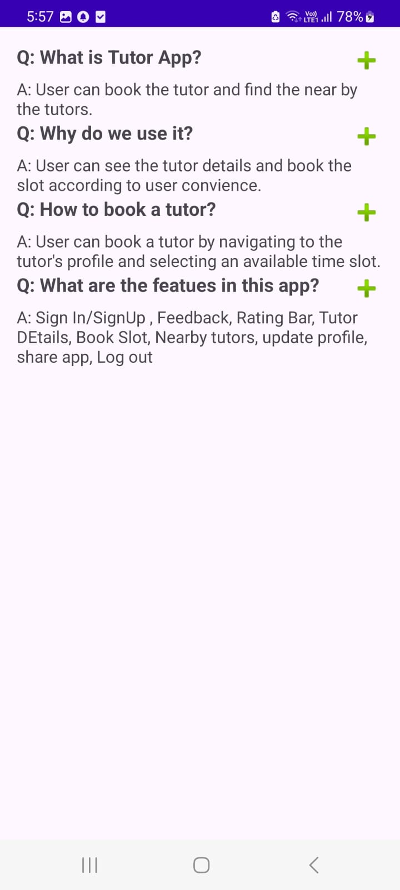
    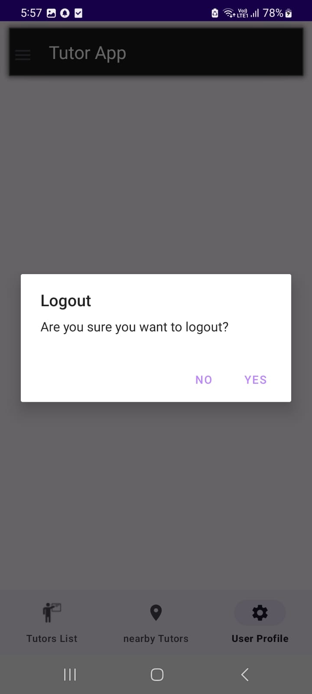

🔗 **Demo Video**: 

